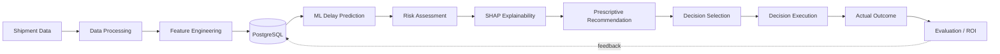
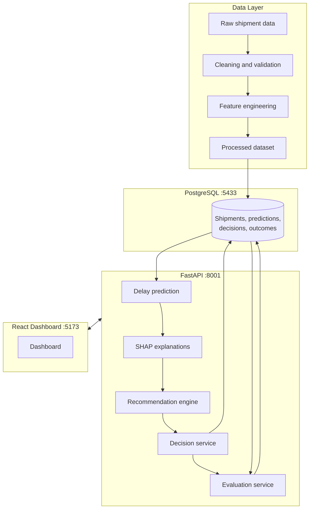
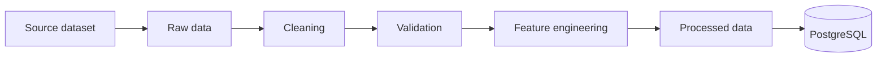
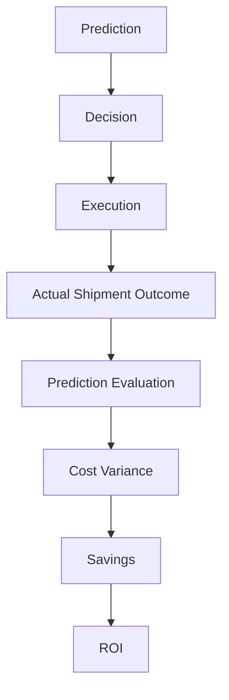

<!--
TEMPLATE NOTE (delete this comment before publishing)
1. Run `python inspect_repo.py` from the project root -> repo_report.md
2. In VS Code press Ctrl+Shift+F and search for  [[FILL  to jump to every placeholder.
3. Replace each placeholder with a value from repo_report.md. If the feature/metric/table
   does not exist in the code, delete the row or sentence. Never keep a guess.
4. Badges: delete any badge for a technology that repo_report.md (section 5 / 16) did not confirm.
-->

<div align="center">

# SUPPLY PRESCRIPT

### Closed-Loop Prescriptive Analytics Platform for Supply Chain Risk

*Don't just predict what will happen. Recommend what the business should do, execute the decision, measure the outcome, and learn from it.*


</div>

Supply Prescript is a closed-loop decision platform for shipment delay risk. It predicts the probability that a shipment will be late, explains the drivers behind each prediction, recommends a specific operational action, records and executes the chosen decision, compares it against the actual shipment outcome, and quantifies the cost impact. Every decision becomes measurable feedback, so the system evaluates not only whether a prediction was correct but whether the action taken was worth it.

---

## Table of Contents

1. [Overview](#1-overview)
2. [Business Problem](#2-business-problem)
3. [Solution](#3-solution)
4. [Key Features](#4-key-features)
5. [System Architecture](#5-system-architecture)
6. [Technology Stack](#6-technology-stack)
7. [Data Pipeline](#7-data-pipeline)
8. [Feature Engineering](#8-feature-engineering)
9. [Machine Learning](#9-machine-learning)
10. [Model Performance](#10-model-performance)
11. [Explainable AI](#11-explainable-ai)
12. [Prescriptive Optimization](#12-prescriptive-optimization)
13. [Decision Management](#13-decision-management)
14. [Closed-Loop Evaluation](#14-closed-loop-evaluation)
15. [Dashboard](#15-dashboard)
16. [API Documentation](#16-api-documentation)
17. [Database](#17-database)
18. [MLOps / Model Management](#18-mlops--model-management)
19. [Testing](#19-testing)
20. [Docker](#20-docker)
21. [Installation](#21-installation)
22. [Running the Application](#22-running-the-application)
23. [Project Structure](#23-project-structure)
24. [Results](#24-results)
25. [Engineering Highlights](#25-engineering-highlights)
26. [Limitations](#26-limitations)
27. [Future Improvements](#27-future-improvements)
28. [Conclusion](#28-conclusion)

---

## 1. Overview

Supply Prescript addresses shipment delay risk in supply chains. A conventional analytics project stops at a delay probability. This project continues through the rest of the decision cycle:

1. **Predict** the probability that a shipment will be delayed.
2. **Explain** which shipment attributes drive that probability.
3. **Recommend** an operational action, weighing cost, risk reduction and speed.
4. **Record and execute** the decision with an audit trail.
5. **Observe** the actual shipment outcome.
6. **Evaluate** prediction correctness, cost variance, savings and ROI.

Prediction alone is insufficient because a probability does not tell an operator what to do, what it will cost, or whether the action helped. Closing the loop turns a model score into a measurable business decision.

## 2. Business Problem

| Problem | How the platform addresses it |
|---|---|
| Shipment delays | [[FILL: delay prediction + threshold, see §9]] |
| Transportation risk | [[FILL: e.g. transport_risk_score feature, if it exists]] |
| High-value shipments | [[FILL: e.g. high_value_shipment feature / cost weighting, if it exists]] |
| Operational decision-making | [[FILL: recommendation engine + alternatives, see §12]] |
| Cost vs. risk trade-offs | [[FILL: policy weights / cost model, see §12]] |

> Remove any row the code does not support.

## 3. Solution



| Stage | Question it answers | Implemented by |
|---|---|---|
| **Prediction** | How likely is this shipment to be delayed? | [[FILL: module/endpoint]] |
| **Recommendation** | What is the best action given cost, risk and speed? | [[FILL: module/endpoint]] |
| **Decision** | Which action was selected and persisted? | [[FILL: module/endpoint]] |
| **Execution** | Was the action carried out, and when? | [[FILL: module/endpoint]] |
| **Outcome** | What actually happened to the shipment? | [[FILL: module/endpoint]] |
| **Evaluation** | Was the prediction right, and was the decision worth it? | [[FILL: module/endpoint]] |

## 4. Key Features

| Capability | Implementation |
|---|---|
| Shipment data processing | [[FILL]] |
| Feature engineering | [[FILL: number of engineered features]] |
| Delay prediction | [[FILL: model, e.g. XGBoost classifier]] |
| Risk classification | [[FILL: bands/thresholds]] |
| SHAP explainability | [[FILL: global / per-shipment]] |
| Prescriptive recommendation | [[FILL: rule/policy-based or mathematical optimisation]] |
| Alternative actions | [[FILL]] |
| Decision write-back | [[FILL: transactional? table]] |
| Decision execution | [[FILL: status + timestamp]] |
| Outcome recording | [[FILL]] |
| Cost / ROI evaluation | [[FILL]] |
| Model registry / versioning | [[FILL: or delete row]] |
| React dashboard | [[FILL: pages]] |
| Dockerised services | [[FILL: services]] |

> Keep only rows confirmed in `repo_report.md`.

## 5. System Architecture



[[FILL: rename the diagram boxes to the real module and table names from repo_report.md §1, §6 and §7, then delete this line. The names above are generic.]]

## 6. Technology Stack

| Layer | Technology | Purpose |
|---|---|---|
| Language | Python [[FILL: version]] | Backend, ML, data pipeline |
| API | FastAPI [[FILL]] | REST API and OpenAPI docs |
| Database | PostgreSQL [[FILL: version]] | Persistent storage |
| ORM | SQLAlchemy [[FILL]] | Data models and access |
| ML | XGBoost, scikit-learn [[FILL]] | Delay classifier, evaluation |
| Explainability | SHAP [[FILL]] | Feature attributions |
| Data | pandas, NumPy [[FILL]] | Processing, feature engineering |
| Serialization | joblib [[FILL]] | Model persistence |
| Frontend | React, Vite, Recharts [[FILL]] | Dashboard |
| Testing | pytest [[FILL]] | Backend tests |
| Containers | Docker, Docker Compose [[FILL]] | Reproducible services |

> Source: `repo_report.md` §4, §5, §16. Delete every row whose package is not listed there.

## 7. Data Pipeline



| Step | What happens |
|---|---|
| Source dataset | [[FILL: name and origin]] |
| Raw data | [[FILL: path, rows x columns]] |
| Cleaning | [[FILL: what is fixed/dropped]] |
| Validation | [[FILL: checks performed]] |
| Feature engineering | See [§8](#8-feature-engineering) |
| Processed data | [[FILL: path, rows x columns]] |
| Database loading | [[FILL: script name]] |

## 8. Feature Engineering

| Feature | Definition (from code) | Purpose |
|---|---|---|
| `actual_delay_days` | [[FILL]] | [[FILL]] |
| `delay_flag` | [[FILL]] | Classification target |
| `shipment_value_usd` | [[FILL]] | [[FILL]] |
| `freight_cost_ratio` | [[FILL]] | [[FILL]] |
| `insurance_cost_ratio` | [[FILL]] | [[FILL]] |
| `quantity_weight_ratio` | [[FILL]] | [[FILL]] |
| `weight_per_unit` | [[FILL]] | [[FILL]] |
| `transport_risk_score` | [[FILL]] | [[FILL]] |
| `high_value_shipment` | [[FILL]] | [[FILL]] |
| `shipment_complexity_score` | [[FILL]] | [[FILL]] |
| Scheduled-date features | [[FILL]] | [[FILL]] |

> Source: `repo_report.md` §8 and §9. Delete any feature that is not created in the code, and add any that are.

## 9. Machine Learning

| Aspect | Detail |
|---|---|
| Task | Binary classification: will the shipment be delayed? |
| Target variable | [[FILL]] |
| Input features | [[FILL: count + list or link to §8]] |
| Leakage prevention | [[FILL: which columns are excluded and why, e.g. post-shipment fields]] |
| Split strategy | [[FILL: train / validation / test proportions, stratified?, seed]] |
| Model | [[FILL: XGBClassifier]] |
| Key hyperparameters | [[FILL: n_estimators, max_depth, learning_rate, scale_pos_weight ...]] |
| Threshold selection | [[FILL: value and how it was chosen, on which split]] |
| Serialization | [[FILL: file path and format]] |

**Why probability matters downstream.** The predicted delay probability is not only a label. It feeds the risk classification and the recommendation engine, where it is weighed against the cost and speed of each candidate action.

[[FILL: if several model versions exist, add a short table describing how they differ]]

## 10. Model Performance

| Item | Value |
|---|---|
| Evaluated on | [[FILL: held-out test set]] |
| Test set size | [[FILL]] |
| Classification threshold | [[FILL]] |
| Source of these numbers | [[FILL: file path]] |

| Metric | Value |
|---|---:|
| Accuracy | [[FILL]] |
| Precision | [[FILL]] |
| Recall | [[FILL]] |
| F1 | [[FILL]] |
| ROC-AUC | [[FILL]] |

> Report **test-set** metrics only. Do not mix in validation metrics or closed-loop evaluation results (see §14 and §24).

## 11. Explainable AI

[[FILL: explain how SHAP is used in this repo]]

| Explanation type | Supported | Endpoint |
|---|---|---|
| Global feature importance | [[FILL: yes/no]] | [[FILL]] |
| Per-shipment explanation | [[FILL: yes/no]] | [[FILL]] |

- **Positive SHAP value:** the feature pushes the shipment's delay probability up.
- **Negative SHAP value:** the feature pushes it down.

```bash
# Only keep if the endpoint exists
curl http://localhost:8001[[FILL: /path/to/explanation/{id}]]
```

## 12. Prescriptive Optimization

**Approach:** [[FILL: state exactly what the code does, e.g. "rule/policy-based scoring of candidate actions". Only say "mathematical optimisation" if repo_report.md §5 shows PuLP/SciPy/OR-Tools imported and used.]]

| Action | Description | Cost | Risk reduction | Speed |
|---|---|---|---|---|
| [[FILL: action 1]] | [[FILL]] | [[FILL]] | [[FILL]] | [[FILL]] |
| [[FILL: action 2]] | [[FILL]] | [[FILL]] | [[FILL]] | [[FILL]] |

| Element | Detail |
|---|---|
| Objective | [[FILL]] |
| Cost considerations | [[FILL]] |
| Risk considerations | [[FILL]] |
| Speed considerations | [[FILL]] |
| Policy weights | [[FILL: values from repo_report.md §8]] |
| Alternative actions | [[FILL: how ranked alternatives are returned]] |

## 13. Decision Management

| Concept | Detail |
|---|---|
| Recommendation | [[FILL]] |
| Selected action | [[FILL]] |
| Persistence | [[FILL: table, transactional write-back?]] |
| Execution | [[FILL: endpoint, status values]] |
| Timestamps | [[FILL: e.g. created / executed fields]] |
| Notes / audit | [[FILL: fields]] |

Endpoints are listed in [§16](#16-api-documentation).

## 14. Closed-Loop Evaluation



| Field | Definition / formula (from code) |
|---|---|
| Prediction correctness | [[FILL]] |
| Cost variance | [[FILL]] |
| Savings | [[FILL]] |
| ROI | [[FILL]] |

**Scope of each measurement** (these are different populations and must not be combined):

| Measurement | Population | Size | What it tells you |
|---|---|---:|---|
| Model test metrics | Held-out test split | [[FILL]] | Predictive quality of the classifier |
| Historical records | [[FILL]] | [[FILL]] | [[FILL]] |
| Clean evaluation batch | [[FILL]] | [[FILL]] | End-to-end closed-loop behaviour |

## 15. Dashboard

| Page / component | Shows |
|---|---|
| [[FILL: KPI cards]] | [[FILL]] |
| [[FILL: risk visualisation]] | [[FILL]] |
| [[FILL: decision mix]] | [[FILL]] |
| [[FILL: outcome monitoring]] | [[FILL]] |
| [[FILL: recent decisions]] | [[FILL]] |
| [[FILL: model information]] | [[FILL]] |

> Source: `repo_report.md` §16 (source files and client routes). List only pages that exist.

## 16. API Documentation

Interactive OpenAPI docs: **http://localhost:8001/docs** *(confirm port in §20)*

> Paste the rows from `repo_report.md` §6. Remember the `include_router` prefix, for example `/api`, when writing the full path. Delete any group that has no endpoints.

### Health
| Method | Endpoint | Purpose |
|---|---|---|
| [[FILL]] | [[FILL]] | [[FILL]] |

### Prediction
| Method | Endpoint | Purpose |
|---|---|---|
| [[FILL]] | [[FILL]] | [[FILL]] |

### Recommendations
| Method | Endpoint | Purpose |
|---|---|---|
| [[FILL]] | [[FILL]] | [[FILL]] |

### Decisions
| Method | Endpoint | Purpose |
|---|---|---|
| [[FILL]] | [[FILL]] | [[FILL]] |

### Outcomes
| Method | Endpoint | Purpose |
|---|---|---|
| [[FILL]] | [[FILL]] | [[FILL]] |

### Evaluations
| Method | Endpoint | Purpose |
|---|---|---|
| [[FILL]] | [[FILL]] | [[FILL]] |

### Models
| Method | Endpoint | Purpose |
|---|---|---|
| [[FILL]] | [[FILL]] | [[FILL]] |

## 17. Database

PostgreSQL, accessed through SQLAlchemy. [[FILL: how tables are created: create_all / Alembic / SQL script]]

| Table | Purpose | Key columns / relationships |
|---|---|---|
| [[FILL]] | [[FILL]] | [[FILL: FKs from repo_report.md §7]] |

## 18. MLOps / Model Management

| Capability | Status |
|---|---|
| Model serialization | [[FILL]] |
| Model registry / versioning | [[FILL: Implemented / Not implemented]] |
| Active-model selection | [[FILL: Implemented / Not implemented]] |
| Automated retraining | [[FILL: Implemented / Not implemented]] |
| Drift / performance monitoring | [[FILL: Implemented / Not implemented]] |

Anything marked "Not implemented" belongs in [§27](#27-future-improvements), not here.

## 19. Testing

```bash
pytest
```

| Item | Detail |
|---|---|
| Framework | pytest |
| Number of tests | [[FILL: exact count from `python inspect_repo.py --pytest`]] |
| Coverage areas | [[FILL: routes, services, ML, evaluation ...]] |

## 20. Docker

| Service | Host port | Container port | Purpose |
|---|---:|---:|---|
| PostgreSQL | 5433 | 5432 | Database |
| FastAPI backend | 8001 | 8000 | API |
| Frontend | 5173 | [[FILL]] | Dashboard |

Isolated host ports are used so the stack can run alongside other local projects. Services on the internal Docker network talk to each other on the container ports.

> Confirm every port and service name against the compose file (`repo_report.md` §14). Credentials in `docker-compose.yml` and `.env` are development defaults and are intentionally not reproduced here.

## 21. Installation

**Prerequisites:** Python [[FILL]], Node.js [[FILL]], Docker Desktop, Git.

```powershell
# 1. Clone
git clone [[FILL: repository-url]]
cd [[FILL: folder]]

# 2. Python environment
python -m venv .venv
.\.venv\Scripts\Activate.ps1

# 3. Backend dependencies
pip install -r requirements.txt

# 4. Frontend dependencies
cd frontend
npm install
cd ..

# 5. Environment variables (only if the repo ships a template)
copy .env.example .env

# 6. Start PostgreSQL
docker compose up -d [[FILL: db-service-name]]

# 7. Initialise the database
[[FILL: exact command, e.g. python -m scripts.init_db]]
```

## 22. Running the Application

**Backend**
```powershell
uvicorn [[FILL: module:app, e.g. backend.app.main:app]] --reload --port 8001
```

**Frontend**
```powershell
cd frontend
npm run dev
```

**Docker (full stack)**
```powershell
docker compose up --build
```

| Service | URL |
|---|---|
| Frontend | http://localhost:5173 |
| API | http://localhost:8001 |
| Swagger UI | http://localhost:8001/docs |

## 23. Project Structure

```text
[[FILL: paste the tree from repo_report.md §1, trimmed to the useful directories]]
```

## 24. Results

### ML Test Performance
[[FILL: table from §10. State split, test size and threshold.]]

### Closed-Loop Evaluation
[[FILL: results with the exact scope, e.g. "clean evaluation batch of N shipments". Do not mix with the model test metrics.]]

### System Validation
[[FILL: test count and result, end-to-end verification steps that were actually run.]]

## 25. Engineering Highlights

| Highlight | Evidence in the repository |
|---|---|
| Leakage-aware ML pipeline | [[FILL]] |
| Explainable predictions | [[FILL]] |
| Prescriptive decisions with alternatives | [[FILL]] |
| Transactional decision write-back | [[FILL]] |
| Outcome evaluation and ROI | [[FILL]] |
| Auditability | [[FILL]] |
| API-driven full-stack architecture | [[FILL]] |
| Dockerised services | [[FILL]] |

> Keep only rows you can point to in the code.

## 26. Limitations

- [[FILL: dataset limitations, e.g. source, size, or synthetic fields]]
- [[FILL: recommendation policy is rule/weight-based and is not learned from outcomes, if true]]
- [[FILL: action costs/effects are assumptions rather than measured values, if true]]
- [[FILL: no live shipment integration, if true]]

## 27. Future Improvements

The items below are **not implemented**.

- Real-time ingestion (for example Kafka)
- Stronger mathematical optimisation of the action choice
- Automated retraining
- Drift and performance monitoring
- Authentication and role-based access
- Cloud deployment
- Connectors to production data sources

> Remove anything from this list that already exists in the repo.

## 28. Conclusion

Supply Prescript demonstrates a complete path from predictive analytics to prescriptive decision-making and measurable business outcomes. A delay probability is explained, converted into a recommended action, executed and audited, then compared with what actually happened, so each decision can be evaluated in cost terms and used to improve the next one.

---

## Author

[[FILL: name]] · [[FILL: LinkedIn / GitHub link]]

## License

[[FILL: license, or delete this section]]
